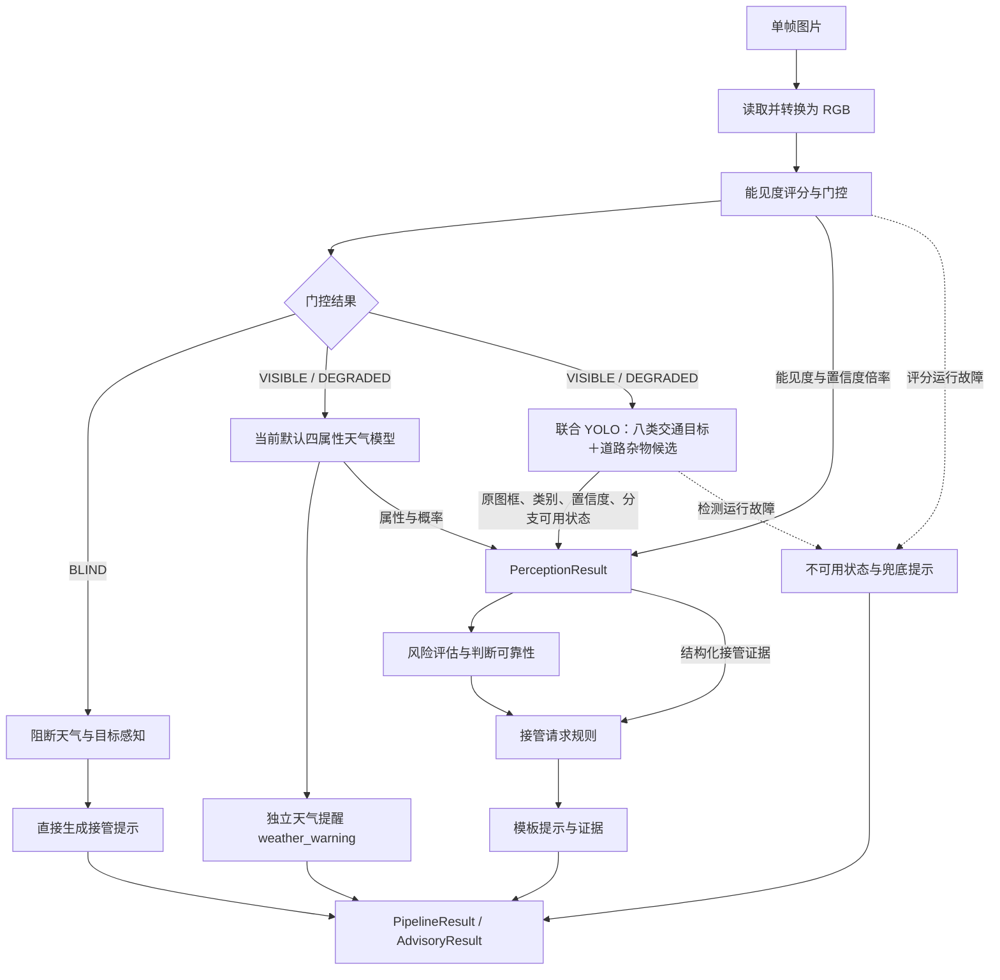
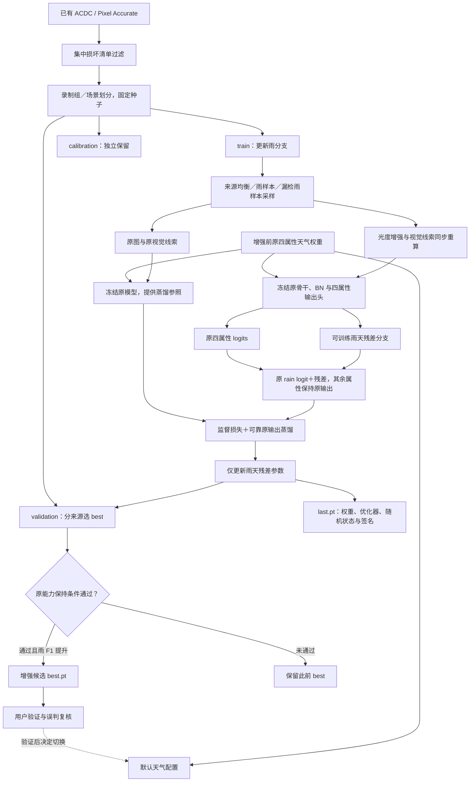

# 架构示意图

## 当前推理链路

```mermaid
flowchart TD
    Image[单帧图片] --> RGB[读取并转换为 RGB]
    RGB --> Gate[能见度评分与门控]
    Gate --> Level{门控结果}
    Level -->|BLIND| Blind[阻断天气与目标感知]
    Blind --> Direct[直接生成接管提示]
    Level -->|VISIBLE / DEGRADED| Weather[当前默认四属性天气模型]
    Level -->|VISIBLE / DEGRADED| YOLO[联合 YOLO：八类交通目标＋道路杂物候选]
    Weather --> Warning[独立天气提醒 weather_warning]
    Weather -->|属性与概率| Perception[PerceptionResult]
    YOLO -->|原图框、类别、置信度、分支可用状态| Perception
    Gate -->|能见度与置信度倍率| Perception
    Perception --> Risk[风险评估与判断可靠性]
    Perception -->|结构化接管证据| Handover
    Risk --> Handover[接管请求规则]
    Handover --> Template[模板提示与证据]
    Template --> Result[PipelineResult / AdvisoryResult]
    Direct --> Result
    Warning --> Result
    Gate -.->|评分运行故障| Fallback[不可用状态与兜底提示]
    YOLO -.->|检测运行故障| Fallback
    Fallback --> Result
```

当前天气属性用于独立提醒及恶劣天气＋DEGRADED 的辅助接管；目标天气倍率仍读取旧字段。
YOLO 当前没有距离与方向预测。学习式接管分类头、分割和 LLM 尚未接入。

## 天气增强训练

```mermaid
flowchart TD
    Raw[已有 ACDC / Pixel Accurate] --> Clean[集中损坏清单过滤]
    Clean --> Split[录制组／场景划分，固定种子]
    Split --> Train[train：更新雨分支]
    Split --> Val[validation：分来源选 best]
    Split --> Calibration[calibration：独立保留]
    Original[增强前原四属性天气权重] --> Reference[冻结原模型，提供蒸馏参照]
    Original --> Frozen[冻结原骨干、BN 与四属性输出头]
    Train --> Sampling[来源均衡／雨样本／漏检雨样本采样]
    Sampling --> Augment[光度增强与视觉线索同步重算]
    Augment --> Frozen
    Sampling --> OriginalInput[原图与原视觉线索]
    OriginalInput --> Reference
    Frozen --> Residual[可训练雨天残差分支]
    Frozen --> BaseOutput[原四属性 logits]
    BaseOutput --> Combined[原 rain logit＋残差，其余属性保持原输出]
    Residual --> Combined
    Reference --> Loss[监督损失＋可靠原输出蒸馏]
    Combined --> Loss
    Loss --> Update[仅更新雨天残差参数]
    Update --> Val
    Val --> Guard{原能力保持条件通过？}
    Guard -->|通过且雨 F1 提升| Best[增强候选 best.pt]
    Guard -->|未通过| Retain[保留此前 best]
    Update --> Last[last.pt：权重、优化器、随机状态与签名]
    Best --> Verify[用户验证与误判复核]
    Verify -.->|验证后决定切换| Default[默认天气配置]
    Original --> Default
```

原模型权重保留；增强候选独立保存，当前默认 pipeline 仍使用原模型。
训练策略、结果与雨天效果分析集中在本地开发文档。
